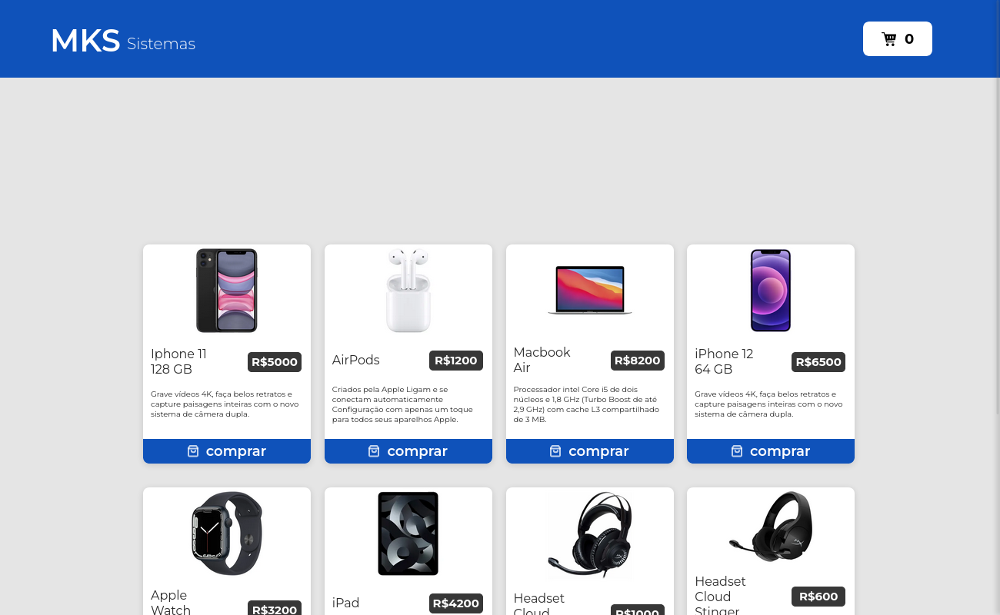
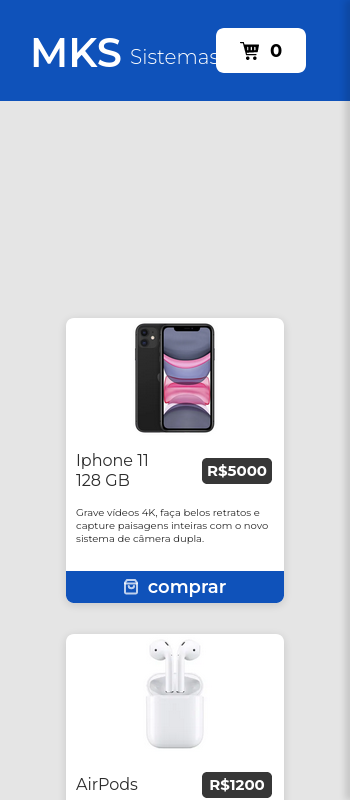

# MKS front-end 

# Descrição

<div style="margin-bottom:2rem;">

<p style="font-size: 15px">O projeto MKS Sistemas tem como objetivo o desenvolvimento de uma aplicação em React que utilize endpoint da API de produtos fornecida pela própria MKS Sistemas.</p>
</div>

# Layout

|        💻 Desktop         |        📱 Mobile         |
| :-----------------------: | :----------------------: |
|  |  |

# Utilização

<p style="font-size: 15px">É possível você utilizar o projeto seguindos estes passos:</p>
<p style="font-size: 15px">Utilize o Git Clone no repositório em uma pasta de sua escolha</p>

```
$ git clone https://github.com/1995william/MKS-front-end.git
```

<p style="font-size: 15px">Execute o comando a seguir no terminal para instalar as dependências</p>

```
$ npm i
ou
$ npm install
```

<p style="font-size: 15px">Para executar o projeto digite</p>

```
$ npm run dev
```

## ou

<p style="font-size: 20px; "><strong>Para acessar o deploy da aplicação:</strong> <a href="https://mks-front-end.vercel.app/" target="_blank" style="font-size: 20px">clique aqui!</a></p>


# Tecnologias e ferramentas utilizadas

<div >
<ul>
<li>React</li>
<li>Styled components</li>
<li>Axios</li>
<li>Redux</li>
<li>Vercel</li>

</ul>

</div>

# Desenvolvedor

<p style="font-size: 15px">Rodrigo William</p>

# Licença

<b>Copyright (c) 2022 Rodrigo William</b>

Esse projeto está sob a licença MIT. Veja o arquivo [LICENSE](./LICENSE) para mais detalhes.